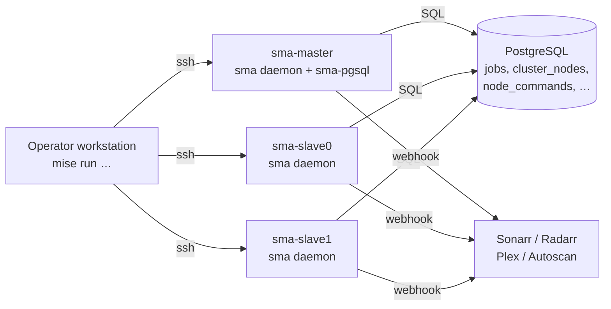

# Cluster Operations

Operator runbook for managing a cluster of SMA-NG nodes remotely via `mise` and
`docker compose`. Each section is a self-contained scenario — the steps to run
when something happens.

For the underlying *reference* material see:

- [Deployment](deployment.md) — every mise task in detail
- [Daemon Mode](daemon.md) — cluster-mode internals (heartbeats, approval flow,
  job queue, admin API)

---

## Cluster shape



- One node carries the bundled PostgreSQL (`*-pg` Docker profile). All other
  nodes connect to it as clients (their compose profile is the non-`-pg`
  variant).
- Every node runs an identical `sma` container reading `config/sma-ng.yml` and
  `config/daemon.env`. Both are stamped per-host by `mise run config:roll`.
- Cluster identity comes from `SMA_NODE_NAME` (stamped into `daemon.env`,
  defaults to the host key in `setup/local.yml`). The same string is what every
  cluster API and `mise run cluster:*` command uses as `node_id`.

---

## Quick reference: cluster control surface

| Action | Mise task | Admin API | DB effect |
|---|---|---|---|
| List node status | `mise run cluster:status` | `GET /admin/nodes` | reads `cluster_nodes` |
| Drain (finish active jobs, stop accepting new) | `mise run cluster:drain HOST=<host>` | `POST /admin/nodes/<host>/drain` | `status='draining'` |
| Pause (immediately stop pickup; active jobs continue) | `mise run cluster:pause HOST=<host>` | `POST /admin/nodes/<host>/pause` | `status='paused'` |
| Resume from drain or pause | `mise run cluster:resume HOST=<host>` | `POST /admin/nodes/<host>/resume` | `status='online'` |
| Graceful restart (drain → reexec) | — (use admin UI or curl) | `POST /admin/nodes/<host>/restart` | `status='restarting'` → `online` |
| Graceful shutdown (drain → exit) | — (use admin UI or curl) | `POST /admin/nodes/<host>/shutdown` | `status='offline'` |
| Approve pending node | — (use admin UI or curl) | `POST /admin/nodes/<host>/approve` | `approval_status='approved'` |
| Hard-delete an offline node row | — (use admin UI or curl) | `POST /admin/nodes/<host>/delete` | row removed |
| Stop / start / restart container | `mise run cluster:{stop,start,restart} HOST=<host>` | — | docker compose |
| Rolling cluster upgrade | `mise run cluster:upgrade` | — | drain → deploy:docker, per host |

All `cluster:*` mise tasks accept `HOST=<one>`, `HOSTS='<a> <b>'`, or default
to `deploy.hosts` from `setup/local.yml`.

---

## Runbook: first-time cluster bootstrap

Local prereqs: `mise`, `python3`, `rsync`, `ssh`, GitHub CLI (`gh`) optional.

1. **Copy the sample local config and fill it in:**

   ```bash
   cp setup/local.yml.sample setup/local.yml
   $EDITOR setup/local.yml
   ```

   Minimum viable shape (one master with bundled Postgres, two slaves):

   ```yaml
   deploy:
     hosts: [sma-master, sma-slave0, sma-slave1]
     deploy_dir: /opt/sma
     ssh_port: 22
     ssh_key: ~/.ssh/id_ed25519_sma
     use_sudo: true
     db_host: 10.30.0.40   # the master's IP
     db_port: 5432
     db_user: iadmin
     db_password: <strong-pw>
     db_name: sma
     docker_profile: intel
   hosts:
     sma-master:
       address: 10.30.0.40
       user: iadmin
       docker_profile: intel-pg   # this host runs the bundled Postgres
     sma-slave0:
       address: 10.30.0.50
       user: iadmin
     sma-slave1:
       address: 10.30.0.51
       user: iadmin
   daemon:
     api_key: <random-string>
   ```

2. **Bootstrap each host (once)** — installs apt deps, Docker, mise, the
   `/opt/sma` layout, and an ssh key:

   ```bash
   mise run deploy:setup
   ```

3. **Sync code to every host:**

   ```bash
   mise run deploy:sync
   ```

4. **Stamp configs and credentials:** writes `config/sma-ng.yml` and
   `config/daemon.env` on every host, with `SMA_NODE_NAME=<host-key>` baked
   into the env file:

   ```bash
   mise run config:roll
   ```

5. **Bring up the containers:**

   ```bash
   mise run cluster:start
   mise run cluster:status   # confirm sma + sma-pgsql healthy on master, sma on slaves
   ```

6. **Approve every pending node** in the master's `/admin` UI (or via
   `POST /admin/nodes/<host>/approve` with `X-API-Key`). Until a node is
   approved its workers wait without claiming jobs — see
   [Daemon Mode → Node approval](daemon.md#node-approval).

---

## Runbook: add a new node to an existing cluster

1. **Add the host entry to `setup/local.yml`:**

   ```yaml
   deploy:
     hosts: [sma-master, sma-slave0, sma-slave1, sma-slave2]
   hosts:
     sma-slave2:
       address: 10.30.0.52
       user: iadmin
   ```

2. **Bootstrap that host only:**

   ```bash
   mise run deploy:setup HOST=sma-slave2
   mise run deploy:sync   HOST=sma-slave2
   mise run config:roll   HOST=sma-slave2
   mise run cluster:start HOST=sma-slave2
   ```

3. **Approve the node** in the master `/admin` UI. The node will start
   claiming jobs on its next heartbeat (≤30s).

---

## Runbook: roll a config change to all nodes

Edit `setup/local.yml` (or any file deep-merged into the rendered
`config/sma-ng.yml` — `base.*`, `profiles.*`, `services.*`), then:

```bash
mise run config:roll
```

`config:roll` is non-destructive: it merges new keys into the existing
`config/sma-ng.yml` on each host, leaving operator-tuned values in place. It
does **not** restart the daemon. To apply changes that require a restart
(routing, profile selection, codec defaults), follow with:

```bash
mise run cluster:restart    # recreates the sma container; in-flight jobs are interrupted
```

For zero-loss restarts, use the upgrade runbook below.

---

## Runbook: cluster-wide image upgrade with no queued-job loss

`cluster:upgrade` does this for you, one node at a time, in `deploy.hosts`
order:

```bash
mise run cluster:upgrade
# DRAIN_TIMEOUT=3600 mise run cluster:upgrade   # raise the per-host wait
```

For each host it:

1. Sends `POST /admin/nodes/<host>/drain` (workers finish active jobs, stop
   accepting new ones).
2. Polls `GET /admin/nodes/<host>` for `running_jobs == 0` (default timeout
   1800s; override with `DRAIN_TIMEOUT=<seconds>`).
3. Runs `mise run deploy:docker HOST=<host>` (rsync, `docker compose pull`,
   `docker compose up -d --force-recreate sma`, healthcheck).
4. The new daemon starts fresh and heartbeats `online` automatically — no
   explicit resume needed.

While one node is draining/upgrading, the other nodes keep claiming new jobs,
so the queue stays serviced.

If a host fails to drain within `DRAIN_TIMEOUT`, the task issues a `resume`
for that host (so it doesn't stay drained forever) and skips it; you can
re-run `cluster:upgrade HOST=<host>` after the slow conversion completes.

---

## Runbook: take a node out of rotation for maintenance

```bash
mise run cluster:drain HOST=sma-slave1
# Wait for cluster:status to show running_jobs=0 on that node
mise run cluster:stop  HOST=sma-slave1   # docker compose stop
# Do the maintenance
mise run cluster:start HOST=sma-slave1
# Heartbeat will flip status back to 'online' on its own
```

Use `cluster:pause` instead of `cluster:drain` only when you want active jobs
to continue but new pickups halted (e.g. while you investigate a slow job).

---

## Runbook: recover from a crashed or unreachable node

When a node misses heartbeats for `--stale-seconds` (default 120s), the
master's `HeartbeatThread.recover_stale_nodes` fires:

- Marks the row `status='offline'`
- Re-queues every job that node had marked `running` so another node can claim
  it on its next poll

If the node never comes back, eventually `--node-expiry-days` (default 7) will
delete the row. To force it sooner:

```bash
# Check status first
curl -sf -H "X-API-Key: $SMA_DAEMON_API_KEY" \
    http://<master>:8585/admin/nodes/sma-slave2

# Hard-delete (only allowed when status='offline')
curl -sf -X POST -H "X-API-Key: $SMA_DAEMON_API_KEY" \
    http://<master>:8585/admin/nodes/sma-slave2/delete
```

If the node is alive but stuck (e.g. hung ffmpeg), restart its container:

```bash
mise run cluster:restart HOST=sma-slave2
```

To trace what happened to the requeued jobs: every job carries the original
`node_id` in its DB row, and the per-config log file
(`/opt/sma/logs/sma-ng.log` on the offending host) holds the FFmpeg output.
See "Read logs across the cluster" below.

---

## Runbook: read logs across the cluster

Three log surfaces exist:

1. **Per-node file log** — `/opt/sma/logs/sma-ng.log` on each host. Worker
   output, FFmpeg stdout, conversion result, the final-output marker
   (`SMA_FINAL_OUTPUT:`) and the per-job summary line all land here.

   ```bash
   ssh iadmin@10.30.0.40 'tail -F /opt/sma/logs/sma-ng.log'
   ```

2. **Centralised cluster log** — every node also writes its log records to the
   `logs` table in the shared Postgres so the master's `/admin/logs` UI can
   show a unified view filterable by node, config, job, and level. The CLI
   equivalent is `GET /admin/logs?node=<host>&job=<id>&level=ERROR`.

3. **Archived per-config files** — when `daemon.log_archive_after_days` is set,
   per-config `.log` files older than that are gzipped into
   `daemon.log_archive_dir`. Read the
   [Daemon Mode → Log archival](daemon.md#log-archival) section for retention
   tuning.

---

## Runbook: PostgreSQL lifecycle

Routine restart (no data loss):

```bash
mise run pg:restart
```

**Destructive recreate** — wipes the `sma-pgdata` Docker volume; only use this
during recovery from corruption or schema reset:

```bash
mise run pg:recreate   # data is GONE
```

After a recreate, every node's heartbeat will register a fresh row; you'll
need to re-approve them via `/admin`.

---

## Docker compose profile reference

| Profile | GPU stack | Bundled Postgres? | Use on |
|---|---|---|---|
| `software` | none (CPU only) | no — uses `db_url` from env | a node without GPU + with an external DB |
| `software-pg` | none (CPU only) | yes (`sma-pgsql` service) | a single-node deployment with no GPU |
| `intel` | Intel QSV / VAAPI | no | a slave with Intel GPU |
| `intel-pg` | Intel QSV / VAAPI | yes | the master in an Intel-GPU cluster |
| `nvidia` | NVIDIA NVENC | no | a slave with NVIDIA GPU |
| `nvidia-pg` | NVIDIA NVENC | yes | the master in an NVIDIA-GPU cluster |

Only one node should run a `*-pg` profile. Set it in
`hosts.<that-host>.docker_profile`; leave the cluster-wide `deploy.docker_profile`
as the non-pg variant for the slaves.

---

## See also

- [Deployment](deployment.md) — task-by-task reference and the full
  `setup/local.yml` schema
- [Daemon Mode](daemon.md) — admin API, heartbeats, approval flow,
  drain/pause/resume internals, log archival
- [Multi-instance Deployment](multi-instance-deployment.md) — running
  multiple SMA daemons on a single host
