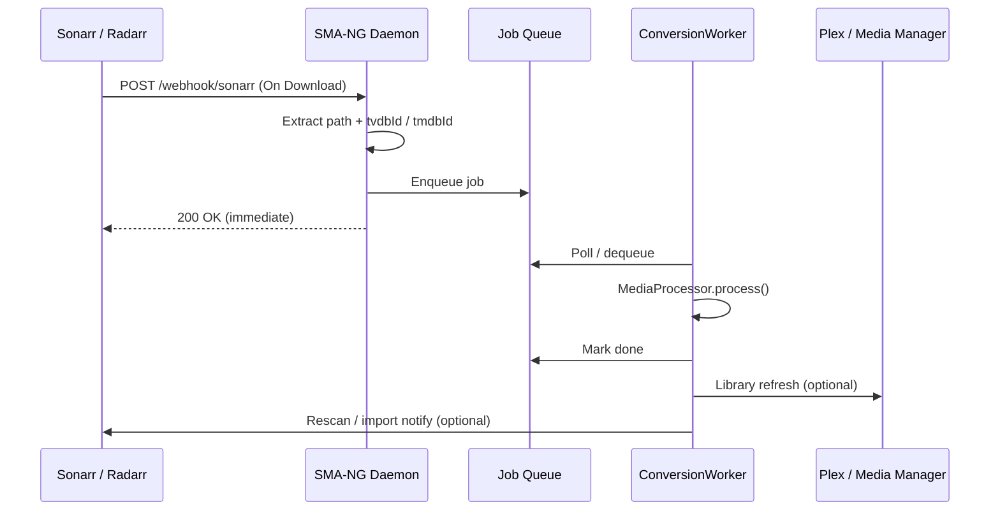

# Integrations

## Media Managers

### Sonarr

Two integration methods are available:

**Native webhook (recommended):** Sonarr posts directly to SMA-NG's built-in endpoint. No external script required.

1. In Sonarr: **Settings → Connect → Add Webhook**
   - On Download/Import: Yes, On Upgrade: Yes
   - URL: `http://<sma-host>:8585/webhook/sonarr`
   - Method: POST
   - If API key is configured, add header `X-API-Key: YOUR_SECRET_KEY`

SMA-NG extracts `episodeFile.path`, `series.tvdbId`, and episode numbers from the Sonarr payload and queues the job automatically. Test events (from the **Test** button) return a 200 OK without queuing anything.

**Custom script:** Suitable when SMA-NG runs locally alongside Sonarr (not in a container).

1. Set API credentials in `[Sonarr]` section of `sma-ng.yml`
2. In Sonarr: **Settings → Connect → Add Custom Script**
   - On Download/Import: Yes, On Upgrade: Yes
   - Path: `/bin/bash`
   - Arguments: full path to `triggers/media_managers/sonarr.sh`

**Per-instance profile routing:** Set `Daemon.path_configs` entries in `sma-ng.yml`, useful when Sonarr imports to a staging path that should use a specific profile:

```yaml
Daemon:
  path_configs:
    - path: /mnt/media/TV
      profile: rq
```

### Radarr

Two integration methods are available:

**Native webhook (recommended):** Radarr posts directly to SMA-NG's built-in endpoint.

1. In Radarr: **Settings → Connect → Add Webhook**
   - On Download/Import: Yes, On Upgrade: Yes
   - URL: `http://<sma-host>:8585/webhook/radarr`
   - Method: POST
   - If API key is configured, add header `X-API-Key: YOUR_SECRET_KEY`

SMA-NG extracts `movieFile.path` and `movie.tmdbId` (or `imdbId` as fallback) and queues the job. Test events return 200 OK without queuing.

**Custom script:** Suitable when SMA-NG runs locally alongside Radarr.

1. Set API credentials in `[Radarr]` section of `sma-ng.yml`
2. In Radarr: **Settings → Connect → Add Custom Script**
   - On Download/Import: Yes, On Upgrade: Yes
   - Path: `/bin/bash`
   - Arguments: full path to `triggers/media_managers/radarr.sh`

**Per-instance config override:** Same as Sonarr — set `SMA_CONFIG` in Radarr's environment.

### Multiple Instances

Sonarr and Radarr each support arbitrary named instances under `services.sonarr.<name>` / `services.radarr.<name>` in `sma-ng.yml`. The instance used for a given file is decided by `daemon.routing` rules — the longest matching `match` prefix wins.

```yaml
services:
  sonarr:
    main:
      host: sonarr.example.com
      apikey: abc123
    kids:
      host: sonarr-kids.example.com
      apikey: def456
  radarr:
    main:
      host: radarr.example.com
      apikey: ghi789
    4k:
      host: radarr-4k.example.com
      apikey: jkl012

daemon:
  routing:
    - match: /mnt/media/TV
      profile: rq
      services: [sonarr.main]
    - match: /mnt/media/TV-Kids
      profile: lq
      services: [sonarr.kids]
    - match: /mnt/media/Movies
      profile: rq
      services: [radarr.main]
    - match: /mnt/media/Movies/4K
      profile: rq
      services: [radarr.4k]
```

When `manual.py` processes `/mnt/media/Movies/4K/film.mkv`, the matcher picks the `/mnt/media/Movies/4K` rule (longest prefix) and triggers a rescan on `radarr.4k`.

The deploy tooling stamps these rules automatically: list each instance with `path` + `profile` under `services.sonarr` / `services.radarr` in `setup/local.yml` and `mise run config:roll` rebuilds `daemon.routing` longest-prefix-first on every roll. See [Deployment](deployment.md).

### Plex

Configure `services.plex.<name>` in `sma-ng.yml`. SMA-NG refreshes the matching library section after conversion. Use `base.path-mapping` if Plex sees files at different mount points.

1. Disable automatic library scanning in Plex to prevent Plex from scanning files mid-conversion
2. Connect directly to the Plex server using its local hostname or IP on port `32400` (or your custom port) and set `token` plus `refresh = true` in `[Plex]`

### Integration Flow

The following sequence applies to both Sonarr and Radarr using the native webhook method:



---

## Download Clients

All download client integrations use bash scripts in `triggers/` that submit jobs to the daemon via webhook. These are not required if you are using Completed Download Handling with Sonarr/Radarr.

### NZBGet

In **Settings → Extension Scripts**, add `triggers/usenet/nzbget.sh`. Configure categories under the script settings.

### SABnzbd

In **Settings → Folders → Scripts Folder**, point to `triggers/usenet/`. Set `sabnzbd.sh` as the category script. Configure `[SABNZBD]` section in `sma-ng.yml`.

### qBittorrent

In **Tools → Options → Downloads → Run external program on torrent completion**:

```bash
bash /path/to/triggers/torrents/qbittorrent.sh "%L" "%T" "%R" "%F" "%N" "%I"
```

Configure `[qBittorrent]` section with host, credentials, and label mappings.

### Deluge

Enable the **Execute** plugin in Deluge WebUI. Set `triggers/torrents/deluge.sh` as the Torrent Complete handler. Configure `[Deluge]` section with daemon host and credentials.

### uTorrent

In **Options → Preferences → Advanced → Run Program**:

```bash
bash /path/to/triggers/torrents/utorrent.sh %L %T %D %K %F %I %N
```
