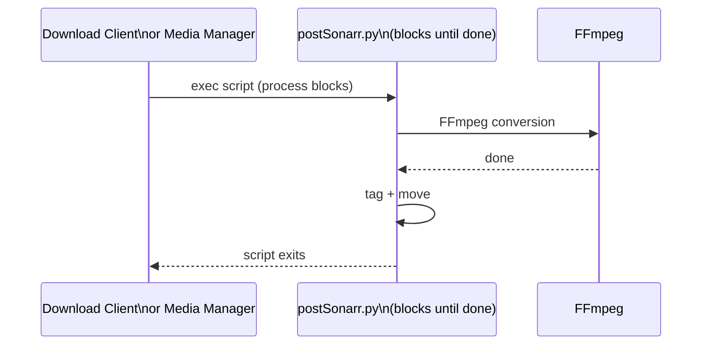
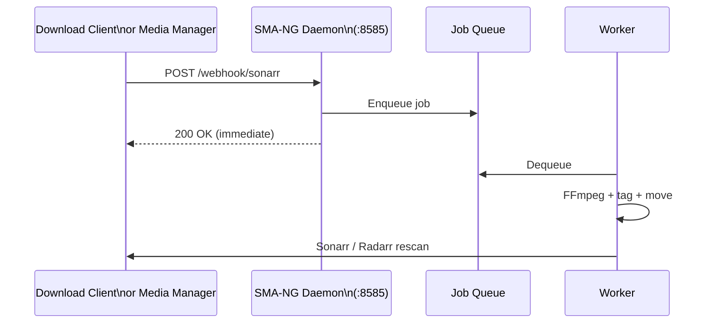

# Migrating from sickbeard_mp4_automator to SMA-NG

SMA-NG is a quasi-fork of [sickbeard_mp4_automator](https://github.com/mdhiggins/sickbeard_mp4_automator) (the original SMA).
It shares the same core goals — convert media files to MP4 with FFmpeg and tag them with TMDB metadata — but has been
substantially re-architected. This guide covers the differences you will encounter when migrating.

---

## What Changed at a Glance

| Area                    | Original SMA                                     | SMA-NG                                                |
| ----------------------- | ------------------------------------------------ | ----------------------------------------------------- |
| Python requirement      | Python 3 (any 3.x)                               | Python **3.12+**                                      |
| Execution model         | Synchronous Python scripts called directly       | Async HTTP daemon with job queue                      |
| Sonarr/Radarr hook      | Custom Script (`postSonarr.py`, `postRadarr.py`) | Native webhook endpoint or bash trigger               |
| Downloader hooks        | Python scripts (`SABPostProcess.py`, etc.)       | Bash scripts (`triggers/*.sh`) posting to daemon      |
| Sickbeard/Sickrage      | Supported (`[Sickbeard]`, `[Sickrage]` sections) | **Removed**                                           |
| Hardware acceleration   | Manual hwaccels/hwdevices config only            | Auto-detection (`make detect-gpu`) + `gpu` key        |
| Multi-instance managers | Single `[Sonarr]` / `[Radarr]` section           | Multiple sections (`[Sonarr-4K]`, `[Radarr-Kids]`, …) |
| Multi-quality profiles  | Single config file                               | Three bundled quality profiles; path-based routing    |
| Job tracking            | None                                             | REST API: `/jobs`, `/health`, `/status`               |
| Docker                  | Separate `sonarr-sma` / `radarr-sma` images      | Single standalone image                               |

---

## Requirements

### Python

SMA-NG requires **Python 3.12 or later**. If your existing install uses an older Python 3.x version, upgrade first.

```bash
python3 --version   # must be 3.12+
```

### Installation

The original SMA used a bare `pip install`. SMA-NG recommends a virtual environment managed by `mise`:

```bash
# Recommended: use mise
mise install
mise run install

# Manual: venv + pip
python3 -m venv venv
source venv/bin/activate
pip install -r setup/requirements.txt
```

---

## Architecture and Process Flow

The most significant change is the shift from synchronous Python scripts to an asynchronous HTTP daemon with a job queue.

### Original flow — synchronous, blocking



### SMA-NG flow — asynchronous, non-blocking



Key implications:

- **The daemon must be running** before any trigger fires. Start it once; it persists in the background.
- Conversion is non-blocking. The trigger returns immediately after the job is accepted.
- Up to `--workers N` conversions can run in parallel.
- Jobs survive daemon restarts (SQLite by default; optional PostgreSQL for multi-node).

### Starting the daemon

```bash
# Minimal — listens on 127.0.0.1:8585
python daemon.py

# Production — all interfaces, 4 workers, API key auth
python daemon.py --host 0.0.0.0 --port 8585 --workers 4 --api-key YOUR_SECRET_KEY
```

---

## Configuration File Changes

The config file is still named `autoProcess.ini` and lives in `config/`. Copy from `setup/autoProcess.ini.sample`.

### Removed sections

These sections no longer exist in SMA-NG. Remove them from your config.

| Section       | Reason                                           |
| ------------- | ------------------------------------------------ |
| `[Sickbeard]` | Sickbeard is no longer a supported media manager |
| `[Sickrage]`  | Sickrage is no longer a supported media manager  |

### New sections

| Section      | Purpose                                                                            |
| ------------ | ---------------------------------------------------------------------------------- |
| `[Analyzer]` | Optional OpenVINO-based per-job content analysis for codec/bitrate recommendations |
| `[Naming]`   | Sonarr/Radarr-style file renaming templates for movies and TV episodes             |

### `[Converter]` — new keys

| New key                        | Default   | Description                                                                    |
| ------------------------------ | --------- | ------------------------------------------------------------------------------ |
| `recycle-bin`                  | _(blank)_ | Directory to copy originals into before deletion when `delete-original = True` |
| `output-directory-space-ratio` | `0.0`     | Minimum free-space ratio before using `output-directory` as scratch space      |

### `[Video]` — key changes

| Original key                  | SMA-NG key           | Notes                                                                                                |
| ----------------------------- | -------------------- | ---------------------------------------------------------------------------------------------------- |
| `video-codec` _(legacy name)_ | `codec`              | Deprecated name is still accepted at startup with a warning; rename it                               |
| `crf` _(single integer)_      | `crf-profiles`       | Now a multi-tier format: `src_kbps:quality:target_rate:max_rate`; multiple profiles separated by `,` |
| _(none)_                      | `gpu`                | Hardware accelerator selector: `qsv`, `nvenc`, `vaapi`, `videotoolbox`, or blank for software        |
| _(none)_                      | `crf-profiles-hd`    | Separate quality-tier profile applied to 4K and larger content                                       |
| _(none)_                      | `b-frames`           | B-frame depth passed to the encoder                                                                  |
| _(none)_                      | `ref-frames`         | Reference frame count passed to the encoder                                                          |
| _(none)_                      | `look-ahead-depth`   | Encoder lookahead depth                                                                              |
| _(none)_                      | `dynamic-parameters` | Auto-fill codec parameters by reading frame data at runtime                                          |
| _(none)_                      | `bitrate-ratio`      | Per-source-codec bitrate multiplier dict, e.g. `h264:0.65, hevc:0.85`                                |

#### `crf` migration example

Original:

```ini
[Video]
crf = 21
```

SMA-NG equivalent (single flat tier):

```ini
[Video]
crf-profiles = 0:21:0:0
```

A more typical multi-tier setup:

```ini
[Video]
crf-profiles = 0:22:3M:6M, 8000:21:5M:10M
crf-profiles-hd = 0:22:20M:30M, 15000:21:25M:50M
```

### `[HDR]` — new keys

`[HDR]` exists in the original but SMA-NG adds the same encoder-tuning keys added to `[Video]`:
`b-frames`, `ref-frames`, `look-ahead-depth`.

### `[Audio]` — deprecated keys replaced by sorting

The following keys are deprecated in SMA-NG. They still parse but will log warnings. Replace them with
entries in `[Audio.Sorting]`.

| Deprecated key                 | Replacement                                             |
| ------------------------------ | ------------------------------------------------------- |
| `prefer-more-channels = True`  | Add `channels.d` to `[Audio.Sorting] sorting =`         |
| `default-more-channels = True` | Add `channels.d` to `[Audio.Sorting] default-sorting =` |
| `copy-original-before = True`  | Reorder entries in `[Audio.Sorting]`                    |

New keys in `[Audio]` with no original equivalent:

| New key                | Default | Description                                                          |
| ---------------------- | ------- | -------------------------------------------------------------------- |
| `allow-language-relax` | `True`  | Fall back to any language if no stream matches the approved list     |
| `relax-to-default`     | `False` | When relaxing language, prefer the default language over others      |
| `ignore-trudhd`        | `True`  | Skip TrueHD streams for containers that cannot carry them (e.g. MP4) |

### `[Universal Audio]` — activation change

| Original behavior                 | SMA-NG behavior                                          |
| --------------------------------- | -------------------------------------------------------- |
| Always active when `codec` is set | Requires `enabled = True` to activate                    |
| `move-after` key _(deprecated)_   | Removed; use `[Audio.Sorting]` position ordering instead |

If you previously relied on Universal Audio being always-on, add `enabled = True` to your `[Universal Audio]` section.

### `[Subtitle.Sorting]` — new key

| New key        | Description                                                        |
| -------------- | ------------------------------------------------------------------ |
| `burn-sorting` | Sorting key list used when selecting which subtitle stream to burn |

### Downloader sections — removed Sickbeard/Sickrage labels

All four downloader sections (`[SABNZBD]`, `[Deluge]`, `[qBittorrent]`, `[uTorrent]`) previously had keys
for routing completed downloads to Sickbeard and Sickrage. These keys have been removed.

| Removed key          | Affected sections                         |
| -------------------- | ----------------------------------------- |
| `sickbeard-category` | `[SABNZBD]`                               |
| `sickrage-category`  | `[SABNZBD]`                               |
| `sickbeard-label`    | `[Deluge]`, `[qBittorrent]`, `[uTorrent]` |
| `sickrage-label`     | `[Deluge]`, `[qBittorrent]`, `[uTorrent]` |

Remove those keys from your config. All other downloader keys are unchanged.

### `[Sonarr]` / `[Radarr]` — multi-instance support

SMA-NG supports multiple Sonarr and Radarr instances by adding extra sections named with a prefix:

```ini
[Sonarr]          ; default instance
host = localhost
port = 8989
apikey = abc123

[Sonarr-4K]       ; additional instance for 4K library
host = localhost
port = 8990
apikey = def456
path = /mnt/media/4K/TV
```

Instance selection is longest-prefix-first against the output file path. The `path` key determines which
instance handles which directories. The original single-instance config still works unchanged.

---

## Integration Changes

### Sonarr and Radarr

| Original                                                    | SMA-NG                                                                        |
| ----------------------------------------------------------- | ----------------------------------------------------------------------------- |
| Custom Script connection: `postSonarr.py` / `postRadarr.py` | **Native webhook** (recommended): `POST /webhook/sonarr` or `/webhook/radarr` |
| —                                                           | **Or** bash trigger script: `triggers/media_managers/sonarr.sh`               |
| Ran inline before Sonarr imported the file                  | Jobs queued and run asynchronously; Sonarr/Radarr rescanned after completion  |

#### Setting up native webhooks (recommended)

In Sonarr: **Settings → Connect → Add → Webhook**

- URL: `http://<daemon-host>:8585/webhook/sonarr`
- On Download / On Import: ✓
- On Upgrade: ✓

In Radarr: **Settings → Connect → Add → Webhook**

- URL: `http://<daemon-host>:8585/webhook/radarr`
- On Download / On Import: ✓
- On Upgrade: ✓

#### Using the bash trigger script (alternative)

If you prefer the old Custom Script connection style:

- Sonarr: Settings → Connect → Custom Script → path to `triggers/media_managers/sonarr.sh`
- Radarr: Settings → Connect → Custom Script → path to `triggers/media_managers/radarr.sh`

### Download clients

All downloader integrations now use **bash wrapper scripts** instead of Python scripts.
The bash scripts submit jobs to the daemon via HTTP and return immediately.

| Download client | Original script             | SMA-NG script                      |
| --------------- | --------------------------- | ---------------------------------- |
| SABnzbd         | `SABPostProcess.py`         | `triggers/usenet/sabnzbd.sh`       |
| NZBGet          | `NZBGetPostProcess.py`      | `triggers/usenet/nzbget.sh`        |
| qBittorrent     | `qBittorrentPostProcess.py` | `triggers/torrents/qbittorrent.sh` |
| Deluge          | `delugePostProcess.py`      | `triggers/torrents/deluge.sh`      |
| uTorrent        | `uTorrentPostProcess.py`    | `triggers/torrents/utorrent.sh`    |

The configuration in each downloader's UI is the same (point to the script). Only the script path changes.

#### SABnzbd example

Original setting: `SABPostProcess.py`

SMA-NG setting: `/path/to/sma/triggers/usenet/sabnzbd.sh`

All category routing keys in `[SABNZBD]` (e.g. `sonarr-category`, `radarr-category`) remain unchanged.

### Dropped integrations

The following media managers are **not supported** in SMA-NG and have no migration path:

- **Sickbeard** — remove the `[Sickbeard]` section and any Sickbeard category/label keys
- **Sickrage** — remove the `[Sickrage]` section and any Sickrage category/label keys

---

## Daemon Configuration (new concept)

SMA-NG adds `daemon.json` (copy from `setup/daemon.json.sample`) for daemon-specific settings.
This file is separate from `autoProcess.ini`.

Key options:

| Key                   | Description                                                                  |
| --------------------- | ---------------------------------------------------------------------------- |
| `default_config`      | Path to the fallback `autoProcess.ini`                                       |
| `api_key`             | Authentication key for the HTTP API                                          |
| `db_url`              | PostgreSQL connection URL for distributed/multi-node mode                    |
| `path_configs`        | List of `{path, config, default_args}` entries for path-based config routing |
| `path_rewrites`       | Path prefix substitutions applied before config matching                     |
| `scan_paths`          | Scheduled background scanning definitions                                    |
| `job_timeout_seconds` | Maximum runtime per job; `0` for unlimited                                   |
| `ffmpeg_dir`          | Directory prepended to `PATH` for FFmpeg binaries                            |

### Path-based config routing

Instead of one config for all content, you can route different paths to different configs:

```json
{
  "default_config": "/config/autoProcess.ini",
  "path_configs": [
    { "path": "/media/TV/4K",     "config": "/config/autoProcess.rq.ini", "default_args": ["--tv"] },
    { "path": "/media/Movies/4K", "config": "/config/autoProcess.rq.ini", "default_args": ["--movie"] },
    { "path": "/media/Kids",      "config": "/config/autoProcess.lq.ini", "default_args": ["--tv"] }
  ]
}
```

Matching is longest-prefix-first: `/media/TV/4K/Show` matches `/media/TV/4K` before `/media/TV`.

---

## Docker

### Original

The original SMA used separate embedded images:

- `mdhiggins/sonarr-sma` — Sonarr with SMA baked in
- `mdhiggins/radarr-sma` — Radarr with SMA baked in

### SMA-NG

SMA-NG ships as a **standalone sidecar container**. Use `docker/docker-compose.yml` as a starting point.

```bash
cp docker/docker-compose.override.yml.example docker/docker-compose.override.yml
# edit docker-compose.override.yml for your paths
docker compose -f docker/docker-compose.yml -f docker/docker-compose.override.yml up -d
```

The container image is published at `ghcr.io/newdave/sma-ng:latest`.

---

## New Features Not in the Original

| Feature                              | Description                                                                           |
| ------------------------------------ | ------------------------------------------------------------------------------------- |
| Hardware acceleration auto-detection | `make detect-gpu` or `mise run detect-gpu` identifies available GPU encoders          |
| Multi-quality config profiles        | Three bundled profiles: `autoProcess.ini`, `autoProcess.rq.ini`, `autoProcess.lq.ini` |
| OpenVINO Analyzer                    | Optional `[Analyzer]` section for content-aware encoding decisions                    |
| File renaming templates              | `[Naming]` section with Sonarr/Radarr-style `{token}` templates                       |
| Recycle bin                          | `recycle-bin` key copies originals before deletion                                    |
| Per-config rotating logs             | Each config gets its own log file in `logs/`; rotates at 10 MB                        |
| Job queue REST API                   | `/jobs`, `/health`, `/status`, `/stats` endpoints for monitoring                      |
| Scheduled background scanning        | `scan_paths` in `daemon.json` periodically scans directories for unprocessed files    |
| Graceful shutdown and restart        | `POST /shutdown` and `POST /restart` drain active jobs before stopping                |
| PostgreSQL clustering                | Optional `db_url` for multi-node distributed mode                                     |

---

## Quick Migration Checklist

Work through these steps in order.

1. **Upgrade Python** to 3.12+ if needed.
2. **Install dependencies** via `mise run install` or `pip install -r setup/requirements.txt`.
3. **Copy the config sample**: `cp setup/autoProcess.ini.sample config/autoProcess.ini`.
4. **Port your settings** from the old `autoProcess.ini`:
   - Remove `[Sickbeard]` and `[Sickrage]` sections.
   - Remove all `sickbeard-*` and `sickrage-*` keys from downloader sections.
   - Rename `video-codec` to `codec` in `[Video]` if present.
   - Migrate `crf` to `crf-profiles` format.
   - Replace deprecated `prefer-more-channels` / `default-more-channels` with `[Audio.Sorting]` entries.
   - Add `enabled = True` to `[Universal Audio]` if you used universal audio previously.
5. **Detect your GPU**: `make detect-gpu` and set `gpu =` in `[Video]` if hardware acceleration is available.
6. **Copy the daemon config sample**: `cp setup/daemon.json.sample config/daemon.json` and configure paths.
7. **Start the daemon**: `python daemon.py --host 0.0.0.0 --port 8585 --workers 2`.
8. **Update Sonarr / Radarr**:
   - Add a Webhook connection pointing to `http://<host>:8585/webhook/sonarr` (or `radarr`).
   - Remove or disable the old Custom Script connection.
9. **Update download client scripts**: replace Python script paths with the new bash script paths under `triggers/`.
10. **Verify**: send a test job and confirm it appears at `http://<host>:8585/jobs`.

---

## Further Reading

- [Getting Started](getting-started.md) — installation and first-run walkthrough
- [Configuration](configuration.md) — complete `autoProcess.ini` reference
- [Daemon Mode](daemon.md) — daemon options, API, clustering
- [Integrations](integrations.md) — Sonarr, Radarr, and download client setup
- [Hardware Acceleration](hardware-acceleration.md) — GPU configuration guide
